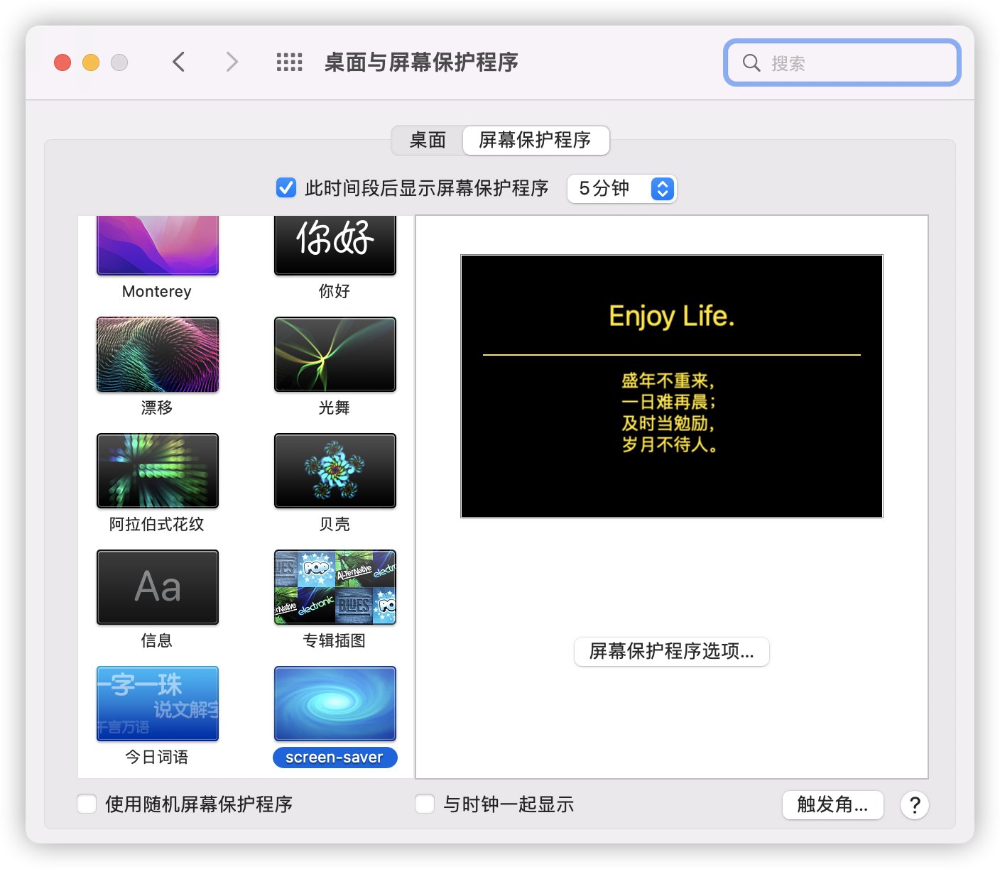

## Screen Saver in macOS

> 巨人的肩膀：[Dawninest/jikeCalendar-macOS](https://github.com/Dawninest/jikeCalendar-macOS)

A macOS screen saver that displays current datetime .

### Installation

* Directly from the [releases](https://github.com/kjh123/ScreenSaver/releases) page. Unpack and double click to install.

* From source (requires [Xcode](https://developer.apple.com/xcode/)):
 
```shell
/bin/bash -c "$(curl -fsSL https://raw.githubusercontent.com/kjh123/ScreenSaver/main/install-from-source.sh)"
```

### Demo

<p align="center">

</a>
</p>

<p align="center">

</a>
</p>

### License

Code is licensed under the [Apache License, Version 2.0 License.](https://github.com/kjh123/ScreenSaver/blob/main/LICENSE)


